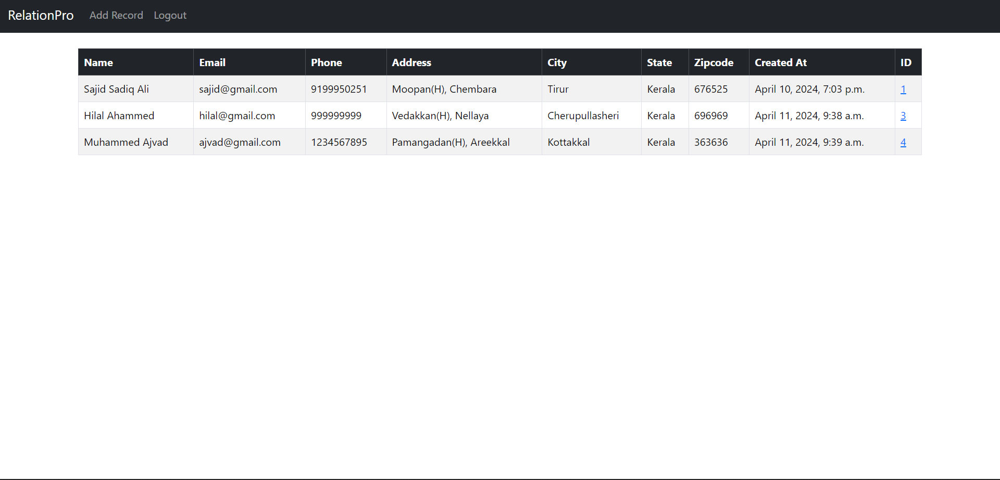
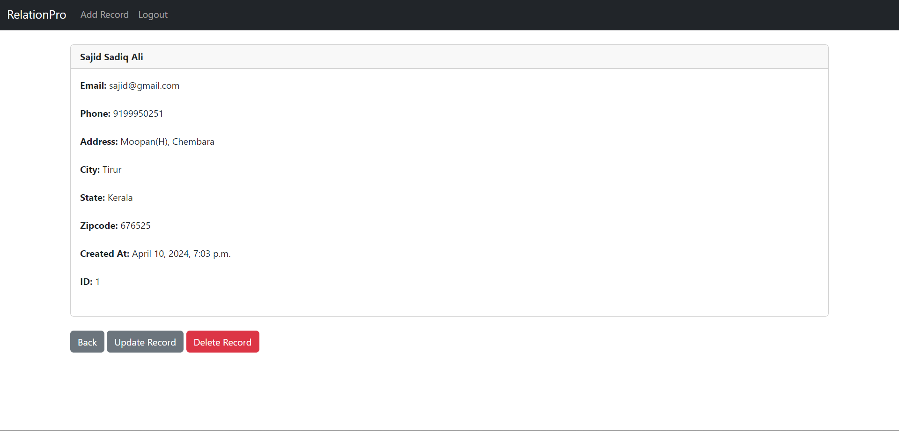

# RelationPro Website

## Features
- User authentication: Register, login, and logout functionality.
- Customer management: Add, update, and delete customer information.
.

## Installation
1. Clone the repository:

   git clone https://github.com/muhammed-anees-pp/CRM-RelationPro.git
   
2. Apply migrations:
   
   python manage.py migrate
  
3. Start the development server:
   
   python manage.py runserver
   
4. Access the CRM website at http://localhost:8000/ in your web browser.

## Usage
- Create a new account or log in with existing credentials.
- Navigate through the dashboard to manage customers, contacts and other records
- Explore the various features and functionalities to effectively manage customer relationships.

